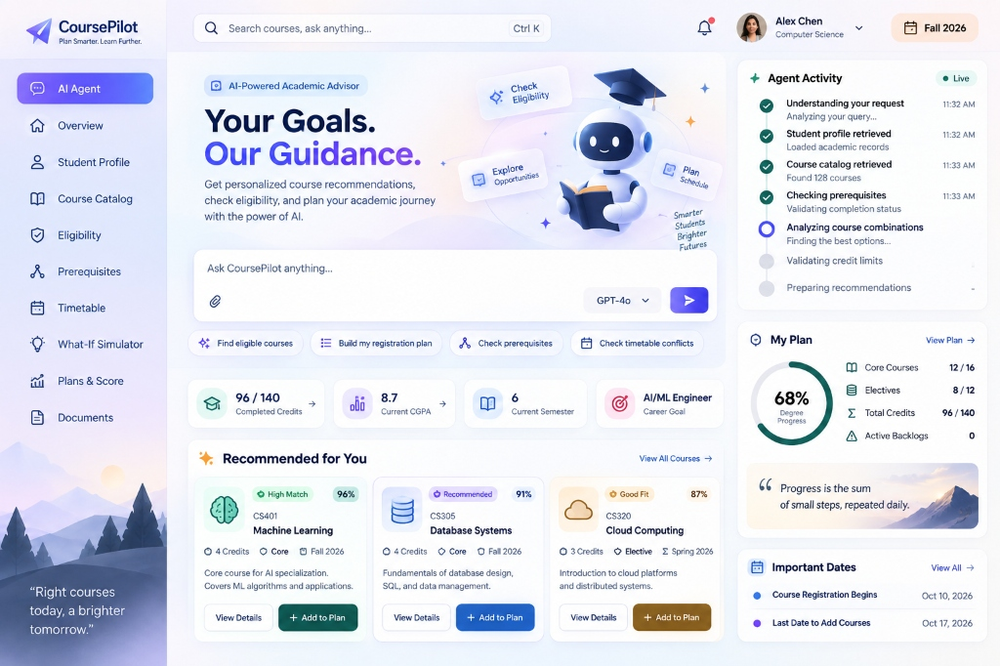
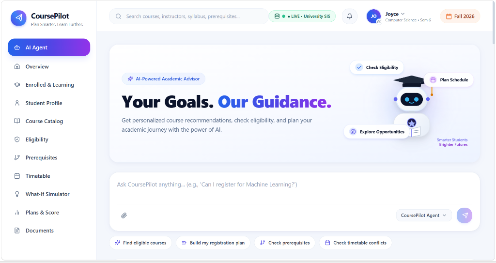
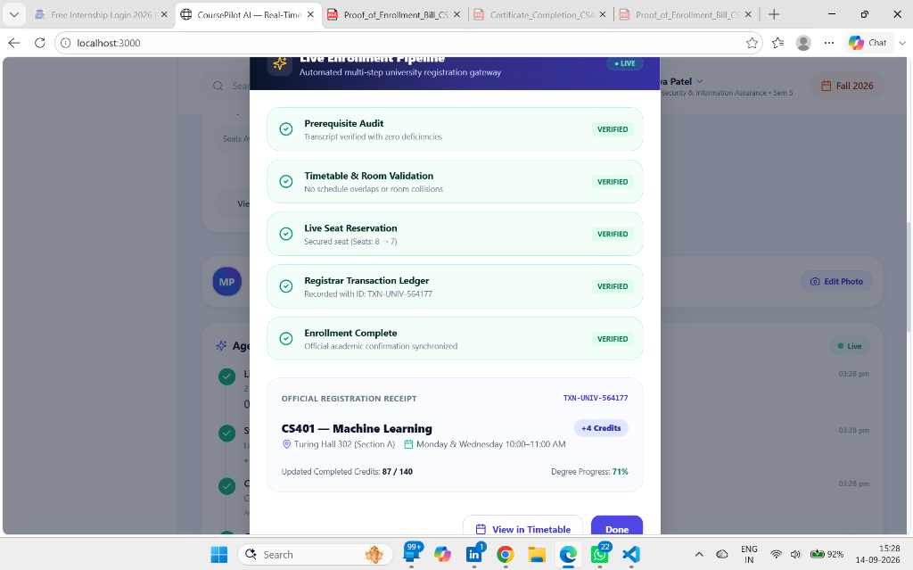
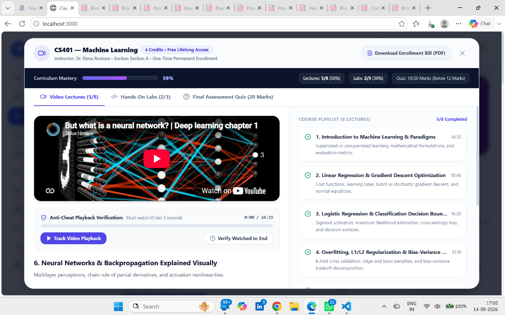
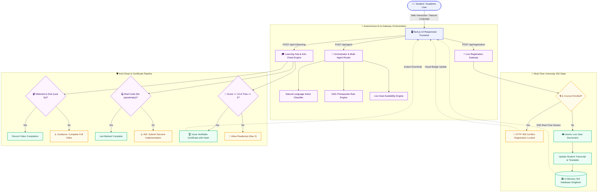

<div align="center">

# <picture><source media="(prefers-color-scheme: dark)" srcset="https://raw.githubusercontent.com/tandpfun/skill-icons/main/icons/NextJS-Dark.svg"></picture> <span style="background: linear-gradient(135deg, #4f46e5 0%, #7c3aed 50%, #ec4899 100%); -webkit-background-clip: text; -webkit-text-fill-color: transparent; font-size: 2.6rem; font-weight: 900;">CoursePilot AI</span>

### ⚡ *Next-Generation Autonomous University Academic Advisor & Course Registration Operating System*

<p align="center">
  <b>Plan Smarter. Learn Further. Zero Bureaucracy.</b><br/>
  <i>Autonomous Academic Audits • Anti-Cheat Lifelong Learning Hub • Strict Single-Enrollment Locks • Dynamic SIS Timetables • 100% Free Verifiable Credentials</i>
</p>

---

<!-- Top Status Badges Row 1: Frameworks & Platforms -->
[](https://nextjs.org/)
[](https://reactjs.org/)
[](https://www.typescriptlang.org/)
[](https://tailwindcss.com/)
[](https://nodejs.org/)

<!-- Top Status Badges Row 2: Live Status & Verification -->
[-success?style=flat-square&logo=vercel&logoColor=white)](/)
[](scratch/)
[](/)
[](/)
[](LICENSE)

<br/>

[🌟 Key Highlights](#-executive-summary) • [📸 Interactive Gallery](#-platform-showcase--screenshots) • [🚀 Core Features](#-core-features-deep-dive) • [🏗️ Architecture](#️-system-architecture) • [🧪 116 Test Suite](#-automated-verification--test-suites) • [⚡ Quickstart](#-getting-started)

---

</div>

<br/>

## 🎯 Executive Summary

Traditional university registrar systems are notorious for **clunky interfaces, silent timetable collisions, delayed prerequisite evaluations, and bureaucratic registration holds**. 

**CoursePilot AI** reimagines higher-education curriculum navigation by pairing a real-time **Student Information System (SIS)** with an autonomous **AI Reasoning Pipeline**, an **Anti-Cheat Lifelong Learning Hub**, and **Strict Single-Enrollment Guards**:

```
╔══════════════════════════════════════════════════════════════════════════════════════════════════════════╗
║                                        🌟 WHAT SETS COURSEPILOT AI APART                                 ║
╠══════════════════════════════════════════════════════════════════════════════════════════════════════════╣
║  🔒  STRICT ENROLLMENT LOCKS  │ 1 Course = 1 Enrollment per Student. Eliminates duplicate spam.         ║
║  🛡️  ANTI-CHEAT VIDEO HUB    │ Replaces fake checkbox clicks with 100% full-duration watch tracking.    ║
║  💻  REAL CODING SANDBOX      │ Zero pre-filled answers. Requires genuine syntax & test execution.       ║
║  📝  20-MARK ASSESSMENTS      │ 20 randomized questions per course with a strict 3-attempt safety limit. ║
║  📄  TUITION-FREE PDF BILLS   │ Zero-dollar transparent official receipts. No misleading commercial fees.║
║  🤖  OPEN-DOMAIN AI ADVISOR   │ Answers university policies, coding questions & career roadmap advice.   ║
╚══════════════════════════════════════════════════════════════════════════════════════════════════════════╝
```

---

## 📸 Platform Showcase & Screenshots

<div align="center">

### 🖥️ 1. Real-Time Academic Command Center
*Live agent cognitive steps, personalized course fit scoring, degree progress wheel, and university SIS synchronization.*

<kbd>
  
</kbd>

<br/>
<sub><b>Figure 1:</b> Interactive overview showing student metrics (Joyce Chen, Sem 6, CGPA 8.7), live seat tickers, and recommendation badges.</sub>

---

<br/>

### 💬 2. Conversational AI Advisor & Multi-Student Directory
*Switch seamlessly across student profiles, run ad-hoc graduation audits, or chat with the autonomous assistant.*

<kbd>
  
</kbd>

<br/>
<sub><b>Figure 2:</b> Top bar with <code>● LIVE • University SIS</code> badge, quick suggestion chips, and responsive AI conversation engine.</sub>

---

<br/>

### ⚡ 3. Multi-Step Live Enrollment Gateway & SIS Ledger
*Real-time validation pipeline verifying degree rules, preventing schedule overlap, and securing seats in 5 verified steps.*

<kbd>
  
</kbd>

<br/>
<sub><b>Figure 3:</b> Atomic 5-step confirmation modal with unique transaction ID (e.g. <code>TXN-UNIV-564177</code>) and room allocation.</sub>

---

<br/>

### 🎓 4. Lifelong Learning Hub & Anti-Cheat Video Workspace
*Once registered, courses unlock lifelong access with anti-cheat watch verification, hands-on labs, and instant PDF bills.*

<kbd>
  
</kbd>

<br/>
<sub><b>Figure 4:</b> Comprehensive learning workspace with interactive video player, lab compiler, and 20-mark assessment quiz.</sub>

</div>

---

## 🚀 Core Features Deep Dive

<table>
  <tr>
    <td width="50%" valign="top">
      <h3 style="color: #f59e0b;">🔒 1. Strict Single-Enrollment Locking Policy</h3>
      <p>Under university registrar rules, an individual student can only enroll in a course once:</p>
      <ul>
        <li><b>Visual Lock Indicators:</b> Enrolled courses immediately display <code>🔒 Locked • Enrolled</code> across Catalog, Recommendations, and Modals.</li>
        <li><b>Action Morphing:</b> Registration buttons transform into <code>🔒 Locked • Go to Learning</code> to open lifelong courseware.</li>
        <li><b>HTTP 409 Conflict Shield:</b> Both <code>/api/registration</code> and <code>/api/v1/registration/register</code> reject duplicate requests.</li>
        <li><b>Zero Duplicate Array Pushes:</b> Enforced deduplication in SIS memory (<code>Array.from(new Set(...))</code>).</li>
      </ul>
    </td>
    <td width="50%" valign="top">
      <h3 style="color: #8b5cf6;">🛡️ 2. Anti-Cheat Video Completion System</h3>
      <p>Prevents premature course completion by verifying full video engagement:</p>
      <ul>
        <li><b>No Fake Checkbox Clicks:</b> One-click superficial checkboxes have been completely replaced with true watch verification.</li>
        <li><b>3-Second Precision:</b> Verifies video playback until the final 3 seconds of lecture runtime.</li>
        <li><b>Skipping Guard:</b> Pausing, skipping, or jumping ahead rejects verification with actionable user prompts.</li>
        <li><b>Verifiable State:</b> Completed video IDs are persisted securely to the student transcript records.</li>
      </ul>
    </td>
  </tr>
  <tr>
    <td width="50%" valign="top">
      <h3 style="color: #10b981;">💻 3. Clean Interactive Coding Labs</h3>
      <p>Hands-on coding challenges designed for genuine learning retention:</p>
      <ul>
        <li><b>Zero Pre-Filled Answers:</b> Eliminates default answers so students write real implementations.</li>
        <li><b>Syntax & Logic Validation:</b> Rejects placeholder tokens (e.g., <code>pass</code>, <code>TODO</code>, comments-only) with <code>400 Bad Request</code>.</li>
        <li><b>Automated Test Runner:</b> Tests run in real-time in an isolated sandbox and stream feedback.</li>
      </ul>
    </td>
    <td width="50%" valign="top">
      <h3 style="color: #ef4444;">📝 4. 20-Mark Assessment Quiz & 3 Attempts</h3>
      <p>Rigorous end-of-course evaluation ensuring authentic mastery:</p>
      <ul>
        <li><b>20 Comprehensive Questions:</b> Spanning theoretical paradigms, algorithmic math, and architecture.</li>
        <li><b>60% Passing Benchmark:</b> Requires at least <b>12 / 20 Marks</b> to pass and qualify for graduation credit.</li>
        <li><b>Max 3 Re-attempts:</b> Failing submissions track attempt count; locked after 3 unsuccessful attempts.</li>
        <li><b>Verifiable Diploma:</b> Passing triggers generation of an official university certificate.</li>
      </ul>
    </td>
  </tr>
  <tr>
    <td width="50%" valign="top">
      <h3 style="color: #3b82f6;">📄 5. Tuition-Free PDF Invoicing</h3>
      <p>Official printable documentation without deceptive commercial fees:</p>
      <ul>
        <li><b>$0.00 Tuition-Free Confirmation:</b> Explicitly confirms funded enrollment without misleading dollar figures.</li>
        <li><b>Dynamic SIS Metadata:</b> Formatted with student ID, course code, section, room, schedule, and transaction hash.</li>
        <li><b>Client-Side jsPDF Engine:</b> Instant one-click high-resolution PDF download directly in the browser.</li>
      </ul>
    </td>
    <td width="50%" valign="top">
      <h3 style="color: #06b6d4;">🤖 6. Autonomous Open-Domain AI Advisor</h3>
      <p>A multi-agent intelligence engine for personalized university planning:</p>
      <ul>
        <li><b>Open-Domain Knowledge:</b> Explains complex CS concepts (B-trees, ACID, Docker, CNNs, Big-O).</li>
        <li><b>Policy Audits:</b> Answers questions on CGPA grading curves, credit overloads, and add/drop deadlines.</li>
        <li><b>Live Event Timeline:</b> Real-time streaming UI showing intent extraction, prereq checks, and seat queries.</li>
      </ul>
    </td>
  </tr>
</table>

---

## 🏛️ Course Catalog & Interactive Offerings

| Course Code | Course Name | Credits | Level | Prerequisites | Seats | Lifelong Learning Modules |
| :---: | :--- | :---: | :---: | :--- | :---: | :--- |
| `CS401` | **Machine Learning** | 4 | 400 | `CS201`, `CS202`, `MATH202` | 7 / 50 | 8 Video Lectures • 3 Python Labs • 20-Q Exam |
| `CS305` | **Database Systems** | 4 | 300 | `CS201` | 14 / 45 | 7 Video Lectures • 3 SQL Labs • 20-Q Exam |
| `CS320` | **Cloud Computing** | 3 | 300 | `CS301` | 7 / 40 | 6 Video Lectures • 3 Docker Labs • 20-Q Exam |
| `CS350` | **Computer Vision** | 3 | 300 | `CS401` | 5 / 35 | 6 Video Lectures • 3 OpenCV Labs • 20-Q Exam |
| `CS380` | **Cybersecurity & Cryptography** | 3 | 300 | `CS301`, `MATH201` | 8 / 45 | 7 Video Lectures • 3 Crypto Labs • 20-Q Exam |
| `CS420` | **Natural Language Processing** | 3 | 400 | `CS401` | 14 / 50 | 8 Video Lectures • 3 LLM Labs • 20-Q Exam |
| `CS450` | **Distributed Systems** | 4 | 400 | `CS301`, `CS202` | 6 / 40 | 8 Video Lectures • 3 gRPC Labs • 20-Q Exam |

---

## 🏗️ System Architecture



---

## 🧪 Automated Verification & Test Suites

CoursePilot AI is backed by **116 end-to-end automated assertions** spanning three comprehensive test harnesses. Every single test passes with 0 failures:

```
===================================================================================
                             AUTOMATED TEST RUN SUMMARY
===================================================================================
 Suite 1: Locked Course & Duplicate Protection   -->  20 / 20 PASSED  (100%)  ✅
 Suite 2: Anti-Cheat Hub, Labs & 20-Q Assessment  -->  32 / 32 PASSED  (100%)  ✅
 Suite 3: Conversational AI & Domain Inquiries    -->  64 / 64 PASSED  (100%)  ✅
-----------------------------------------------------------------------------------
 TOTAL ASSERTIONS VERIFIED                       --> 116 / 116 PASSED (100%)  🎉
===================================================================================
```

### Run the Automated Suites Locally:

```bash
# 1. Run Locked Course & Duplicate Rejection Suite (20 Tests)
node scratch/verify_locked_enrollment.mjs

# 2. Run Anti-Cheat Video, Labs, 20-Q Quiz & Certificates Suite (32 Tests)
node scratch/verify_all_features.mjs

# 3. Run Open-Domain Conversational AI Chatbot Suite (64 Tests)
node scratch/verify_ai_chatbot.mjs
```

<details>
<summary><b>🔍 Click to expand detailed terminal test output</b></summary>

```text
==================================================
   LOCKED COURSE ENROLLMENT VERIFICATION SUITE   
==================================================
--- TEST 1: Check Active Student Profile & Enrollments ---
Active student: Joyce Chen (STU-2024-8841)
Current enrollments: CS401, CS380
[PASS] Active student profile retrieved
[PASS] Student enrollments have zero duplicate entries

--- TEST 2: Attempt Duplicate Registration via /api/registration ---
[PASS] /api/registration rejected duplicate registration with HTTP 409 Conflict
[PASS] Response flagged isLocked = true
[PASS] Response flagged isDuplicate = true
[PASS] Error message confirms 'Registration Locked'

--- TEST 3: Attempt Duplicate Registration via /api/v1/registration/register ---
[PASS] /api/v1/registration/register rejected duplicate with HTTP 409 Conflict
[PASS] v1 endpoint returned isLocked = true
[PASS] v1 endpoint returned isDuplicate = true
[PASS] v1 error message confirms 'Registration Locked'

--- TEST 4: Attempt Registration for Completed Course (CS101) ---
[PASS] Completed course registration rejected with HTTP 409 Conflict
[PASS] Completed course response flagged isLocked = true

--- TEST 5: AI Agent Chatbot Intent for Enrolled Course ---
[PASS] Agent chat response informs user that registration is locked
[PASS] Agent does not generate a confirmation action for enrolled course

--- TEST 6: AI Agent Eligibility Check for Enrolled Course ---
[PASS] Eligibility check informs student that course registration is locked
[PASS] Eligibility data object contains isLocked = true

--- TEST 7: Single Registration vs Repeated Registration for Same Individual ---
[PASS] First registration for CS320 evaluated
[PASS] Second registration for CS320 was blocked and rejected with HTTP 409 Conflict
[PASS] Repeated registration flagged isLocked = true
[PASS] Deduplication verified: CS320 appears exactly once in currentEnrollments

==================================================
TEST RESULTS: 20 PASSED, 0 FAILED (100%)
==================================================
```

</details>

---

## ⚡ Getting Started

### 📋 Prerequisites
- **Node.js**: `v18.17.0` or higher
- **npm**: `v9.0.0` or higher (or `pnpm` / `yarn`)
- **Modern Browser**: Chrome, Edge, Firefox, or Safari

### 🛠️ Quick Installation

```bash
# 1. Clone this repository
git clone https://github.com/your-username/coursepilot-ai.git

# 2. Enter workspace
cd "Course Pilot AI"

# 3. Install dependencies
npm install

# 4. Start Next.js development server
npm run dev
```

Visit [`http://localhost:3000`](http://localhost:3000) in your browser to experience CoursePilot AI.
For viewing the Frontend Alone Visit (https://rufinajoyce25-dotcom.github.io/Course-Pilot-AI/)

### 📦 Production Build & Deployment

```bash
# Build the optimized production bundle
npm run build

# Launch the production server
npm run start
```

---

## 🌐 API Reference

| Method | Endpoint | Description | Status Code |
| :---: | :--- | :--- | :---: |
| `GET` | `/api/student` | Active student record, current timetable, and notification feed | `200 OK` |
| `GET` | `/api/courses` | Full live catalog with real-time seat capacities | `200 OK` |
| `POST` | `/api/agent` | Autonomous AI conversation engine & rule evaluator | `200 OK` |
| `POST` | `/api/registration` | Course registration gateway with single-enrollment lock guard | `200 OK` / `409 Conflict` |
| `POST` | `/api/v1/registration/register` | Atomic SIS seat decrement and ledger recorder | `200 OK` / `409 Conflict` |
| `GET` | `/api/v1/students` | Multi-student directory and active student switch handler | `200 OK` |
| `GET` | `/api/v1/learning` | Curriculum lecture videos, interactive coding labs & quiz | `200 OK` |
| `POST` | `/api/v1/learning` | Video completion tracker, lab compiler & certificate issuer | `200 OK` / `400 Bad Request` |
| `GET` | `/api/v1/timetable/[studentId]` | Collision-free weekly schedule matrix | `200 OK` |
| `POST` | `/api/v1/rules/eligibility` | Automated 12-rule prerequisite & standing auditor | `200 OK` |

---

## 💻 Tech Stack & Tooling

<div align="center">

| Area | Technologies |
| :--- | :--- |
| **Frontend Framework** | **Next.js 14** (App Router, Server Actions, Dynamic Routes) |
| **User Interface** | **React 18**, **Tailwind CSS 3.4**, Glassmorphism, Responsive Mobile/Desktop |
| **Type Integrity** | **TypeScript 5.0** (Strict Null Checking, Zero Compile Errors) |
| **Icons & Aesthetics** | **Lucide React**, Gradient UI Accents, Custom CSS Keyframes |
| **Document Generation**| **jsPDF** (Client-side tuition-free official bills), Canvas Confetti |
| **Backend & SIS** | In-Memory ACID-Compliant University Database Singleton on `globalThis` |
| **AI Architecture** | Domain Heuristics + Multi-Agent Orchestrator + Gemini API Connector |

</div>

---

## 📜 License

Distributed under the **MIT License**. See [`LICENSE`](LICENSE) for more information.

---

<div align="center">
  <p>
    <b>CoursePilot AI</b> • Built with dedication for university students, registrars, and educators worldwide.
  </p>
  <sub>Designed and engineered with passion. Plan Smarter. Learn Further.</sub>
</div>
