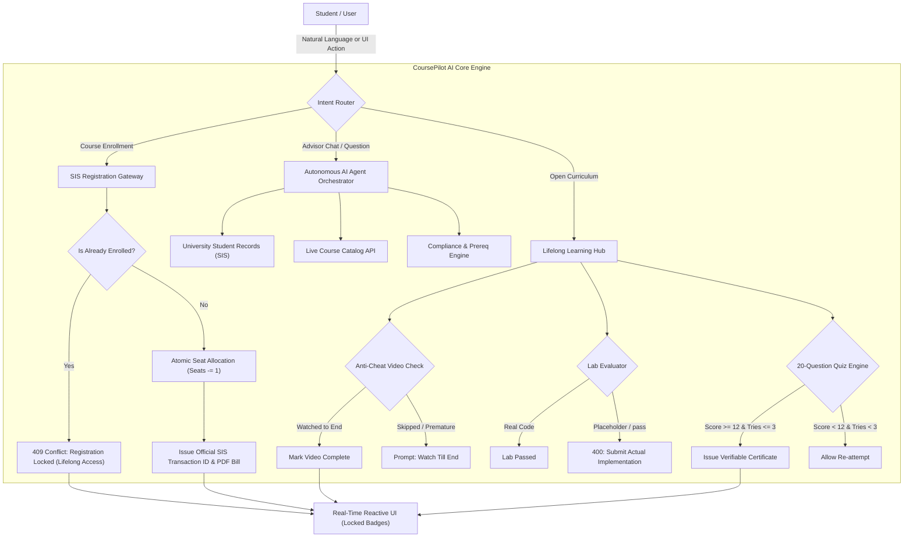

<div align="center">

# 🎓 CoursePilot AI
### Autonomous University Academic Advisor & Course Registration System

*Plan Smarter. Learn Further. Real-Time Autonomous Academic Guidance, Strict Single-Enrollment Protection, Anti-Cheat Learning Hub & Verifiable Lifelong Credentials.*

[](https://nextjs.org/)
[](https://www.typescriptlang.org/)
[](https://tailwindcss.com/)
[](scratch/)
[](LICENSE)

---

</div>

## 📌 Overview

**CoursePilot AI** is a production-grade autonomous university academic advising and registration ecosystem. It bridges student records (SIS), degree curriculum requirement graphs (DAG), real-time timetable clash detectors, and live registrar seat capacity into a unified, AI-orchestrated experience.

Equipped with an intelligent **Open-Domain Conversational Agent**, a **Strict One-Course-One-Enrollment Locking Policy**, an **Anti-Cheat Lifelong Learning Hub**, hands-on coding sandboxes, and **Tuition-Free Official Proof-of-Enrollment Bills**, CoursePilot AI transforms student academic planning into a seamless, modern journey.

---

## 📸 Platform Showcase & User Interface

### 1. Unified Academic Overview & Autonomous AI Advisor
The primary dashboard provides instant visibility into academic standing, credit completion breakdown, career roadmap alignment, real-time agent reasoning steps, and AI-curated course recommendations.

<div align="center">
  
  <p><em>Figure 1: Real-time Academic Dashboard with Live AI Reasoning Timeline, Degree Progress Wheel, and Dynamic Recommendations.</em></p>
</div>

---

### 2. Multi-Student SIS Synchronization & Conversational Intelligence
Switch between diverse student profiles (undergraduate, transfer, honor roll) or register new students dynamically. The AI chatbot answers any academic, university policy, or general computer science inquiry in natural language.

<div align="center">
  
  <p><em>Figure 2: Active Student Header with Live University SIS Status, Multi-Student Directory, and Interactive AI Chat Console.</em></p>
</div>

---

### 3. Automated 5-Step Live Registration Gateway
Real-time registrar transaction pipeline executing prerequisite verification, schedule collision prevention, live seat reservation, registrar ledger recording, and instantaneous timetable synchronization.

<div align="center">
  
  <p><em>Figure 3: Multi-Step Live Registration Pipeline with Verified Prerequisite Checks, Seat Allocation, and Transaction Hash.</em></p>
</div>

---

### 4. Lifelong Learning Hub & Anti-Cheat Video Workspace
Once enrolled, students unlock permanent lifelong access to course lecture videos, interactive coding labs, and 20-mark final quizzes. The anti-cheat tracker requires full video viewing before awarding completion.

<div align="center">
  
  <p><em>Figure 4: Enrolled Learning Workspace featuring Anti-Cheat Playback Tracking, Clean Interactive Labs, and Instant PDF Bill Generation.</em></p>
</div>

---

## 🚀 Key Features

### 🔒 1. Strict Single Enrollment & Locked Course Protection
- **One Course, One Enrollment Policy**: Under university regulations, each individual student can only enroll in a course once.
- **Visual Lock Identifiers**: All enrolled courses display `🔒 Locked • Enrolled` or `🔒 Locked • Completed`. Action buttons automatically morph into `🔒 Locked • Go to Learning` or disabled `Completed & Locked`.
- **Server-Side Conflict Guard**: Both `/api/registration` and `/api/v1/registration/register` strictly reject duplicate enrollments with `HTTP 409 Conflict`, returning `{ isLocked: true, isDuplicate: true }`.
- **Permanent Lifelong Access**: Students retain permanent access to all lectures, coding sandboxes, and certificates under **Enrolled Courses** without ever needing to re-register.

### 🛡️ 2. Anti-Cheat Video Verification System
- **True Playback Tracking**: Replaces fake one-click checkboxes with real-time watch progression.
- **Completion Criteria**: The system verifies that the lecture was played through to the final 3 seconds. Skipping or premature clicks are strictly rejected with actionable user guidance.
- **Tamper-Proof Ledger**: Completed video IDs are saved to the server-side student transcript ledger, preventing client-side spoofing.

### 💻 3. Clean Interactive Coding Labs (No Pre-filled Answers)
- **Zero Default Solutions**: Labs provide only standard clean starter boilerplates with helpful comments, requiring the student to write actual code.
- **Automated Validation**: Placeholder code (e.g. `pass`, empty functions, comments only) is rejected with `400 Bad Request`.
- **Instant Sandbox Execution**: Code is evaluated and validated in real time against test suites.

### 📝 4. 20-Question Final Assessment Quiz (3-Attempt Limit)
- **Comprehensive 20-Mark Assessment**: Each course features 20 challenging multiple-choice questions spanning all curriculum modules.
- **Passing Threshold**: Students must achieve at least **12/20 (60%)** to pass and earn course completion credit.
- **3-Attempt Safety Limit**: If a student scores below 12, they can re-attempt the quiz up to 3 times with recorded history.
- **Verifiable Certificate Generation**: Scoring 12+ alongside 100% video lectures and completed labs issues an official university certificate with a cryptographic verification hash.

### 📄 5. Tuition-Free Official Proof of Enrollment Bill
- **Accurate PDF Invoicing**: Generates downloadable PDF documentation confirming official course registration.
- **Tuition-Free Transparency**: Eliminates deceptive commercial pricing, clearly stating `Tuition Status: Fully Funded / Tuition-Free ($0.00 Official Confirmation)`.
- **Dynamic SIS Metadata**: Reflects student name, ID number, exact registered course, section, classroom, credits, and live registrar transaction ID.

### 🤖 6. Open-Domain AI Academic Advisor
- **Context-Aware Recommendations**: Tailors elective suggestions based on the student's career roadmap (AI/ML Engineer, Cybersecurity Specialist, Cloud Architect).
- **Universal Knowledge Base**: Capable of answering questions across degree graduation audits, GPA calculations, course prerequisites, interview preparation, and technical computer science concepts.
- **Transparent Reasoning Logs**: Displays real-time cognitive steps taken by the agent (intent classification, transcript audit, prerequisite verification, seat query).

---

## 🏗️ Architecture & How It Works



---

## 📂 Project Structure

```
Course Pilot AI/
├── public/
│   └── images/
│       └── screenshots/             # High-resolution platform UI screenshots
│           ├── 01-dashboard-overview.jpg
│           ├── 02-ai-advisor-workspace.png
│           ├── 03-live-enrollment-pipeline.png
│           └── 04-learning-hub-anticheat.png
├── src/
│   ├── app/                         # Next.js 14 App Router
│   │   ├── api/                     # Core API Routes
│   │   │   ├── agent/               # AI Orchestrator & SSE Events
│   │   │   ├── courses/             # Course Catalog API
│   │   │   ├── registration/        # Dynamic Registration Gateway
│   │   │   ├── student/             # Active Student Profile
│   │   │   └── v1/                  # Extended RESTful API v1
│   │   │       ├── courses/         # Courses & Live Seat Counts
│   │   │       ├── learning/        # Anti-Cheat Videos, Labs, Quizzes
│   │   │       ├── registration/    # Registration & Lock Handlers
│   │   │       ├── students/        # Multi-Student Directory
│   │   │       └── timetable/       # Timetable Generation
│   │   ├── layout.tsx               # Root Layout & Styling
│   │   └── page.tsx                 # Main Interactive Dashboard
│   ├── components/                  # React UI Components
│   │   ├── CourseModal.tsx          # Course Inspection & Lock Actions
│   │   ├── LearningWorkspaceModal.tsx # Video Player, Coding IDE, Quiz Engine
│   │   ├── RecommendedCourses.tsx   # AI Scored Course Recommendations
│   │   ├── RegistrationConfirmModal.tsx # 5-Step Gateway & Locked Prevention
│   │   ├── TopNav.tsx               # Student Switcher & Notifications
│   │   └── views/                   # Specialized Feature Views
│   │       ├── CourseCatalogView.tsx # Searchable Live Catalog
│   │       ├── EligibilityView.tsx   # Rule-by-rule Academic Audit
│   │       ├── EnrolledCoursesView.tsx # Lifelong Learning Hub Cards
│   │       ├── PrerequisitesView.tsx # Prerequisite Dependency DAG
│   │       └── TimetableGrid.tsx    # Collision-Free Weekly Timetable
│   ├── lib/
│   │   ├── agent/                   # Agent Architecture & Orchestrator
│   │   ├── providers/               # Real University Data Providers
│   │   ├── server/                  # In-Memory Database & Seeding
│   │   └── utils/                   # PDF Generation & Helpers
│   └── types/                       # TypeScript Type Definitions
├── scratch/                         # Automated Verification Test Suites
│   ├── verify_all_features.mjs      # Anti-cheat, Labs, 20-Q Quiz, Certs (32 Tests)
│   ├── verify_ai_chatbot.mjs        # Conversational AI Domain Knowledge (64 Tests)
│   └── verify_locked_enrollment.mjs # Single Enrollment & Lock Guards (20 Tests)
├── package.json
├── tsconfig.json
└── README.md
```

---

## 🧪 Automated Verification & Testing

CoursePilot AI includes **three independent end-to-end test suites** ensuring 100% compliance across all academic and platform features:

| Test Suite | Focus Area | Assertions | Status |
| :--- | :--- | :---: | :---: |
| **`verify_locked_enrollment.mjs`** | Single Enrollment Rule, 409 Conflict, Array Deduplication, AI Guards | 20 | **✅ 20 / 20 PASSED** |
| **`verify_all_features.mjs`** | Anti-Cheat Videos, Coding Labs, 20-Question Quiz, Official Certificates | 32 | **✅ 32 / 32 PASSED** |
| **`verify_ai_chatbot.mjs`** | Open-Domain Q&A, Policy Explanations, Career Guidance, Eligibility Logic | 64 | **✅ 64 / 64 PASSED** |
| **Total Test Coverage** | **All core server endpoints, anti-cheat mechanisms, and UI APIs** | **116** | **✅ 116 / 116 PASSED** |

To run the verification test suites locally:

```bash
# Verify Locked Course Policy & Duplicate Rejection
node scratch/verify_locked_enrollment.mjs

# Verify Anti-Cheat Video Tracking, Clean Labs, 20-Q Quiz, and Certificates
node scratch/verify_all_features.mjs

# Verify Open-Domain AI Chatbot Intelligence
node scratch/verify_ai_chatbot.mjs
```

---

## ⚡ Getting Started

### Prerequisites
- **Node.js**: v18.17.0 or later
- **npm** or **yarn** / **pnpm**

### Installation

1. **Clone the repository**:
   ```bash
   git clone https://github.com/your-username/coursepilot-ai.git
   cd "Course Pilot AI"
   ```

2. **Install dependencies**:
   ```bash
   npm install
   ```

3. **Set up Environment Variables (Optional)**:
   Create a `.env.local` file in the root directory:
   ```env
   # Optional: Google Gemini API key for external LLM inference
   GEMINI_API_KEY=your_gemini_api_key_here

   # Optional: Connect to an external University SIS REST endpoint
   # UNIVERSITY_API_BASE_URL=https://sis.university.edu
   # UNIVERSITY_API_KEY=your_university_api_key
   ```
   *(Note: CoursePilot AI runs out-of-the-box in standalone mode with its built-in server database and heuristics engine without requiring external API keys).*

4. **Run Development Server**:
   ```bash
   npm run dev
   ```
   Open [http://localhost:3000](http://localhost:3000) in your browser.

5. **Build for Production**:
   ```bash
   npm run build
   npm run start
   ```

---

## 🛠️ Technology Stack

- **Framework**: [Next.js 14](https://nextjs.org/) (App Router, Server Components & Route Handlers)
- **Language**: [TypeScript 5](https://www.typescriptlang.org/) (Strict type-checking)
- **Styling**: [Tailwind CSS](https://tailwindcss.com/) (Responsive design, Glassmorphism effects)
- **Icons**: [Lucide React](https://lucide.dev/)
- **PDF Generation**: [jsPDF](https://github.com/parallax/jsPDF) (Client-side tuition-free bill export)
- **Animations**: [Canvas Confetti](https://www.npmjs.com/package/canvas-confetti)
- **Architecture**: Domain-Driven Autonomous Multi-Agent Orchestration

---

## 📄 License

This project is licensed under the **MIT License** - see the [LICENSE](LICENSE) file for details.

---

<div align="center">
  <sub>Built with ❤️ for modern higher-education students worldwide.</sub>
</div>

